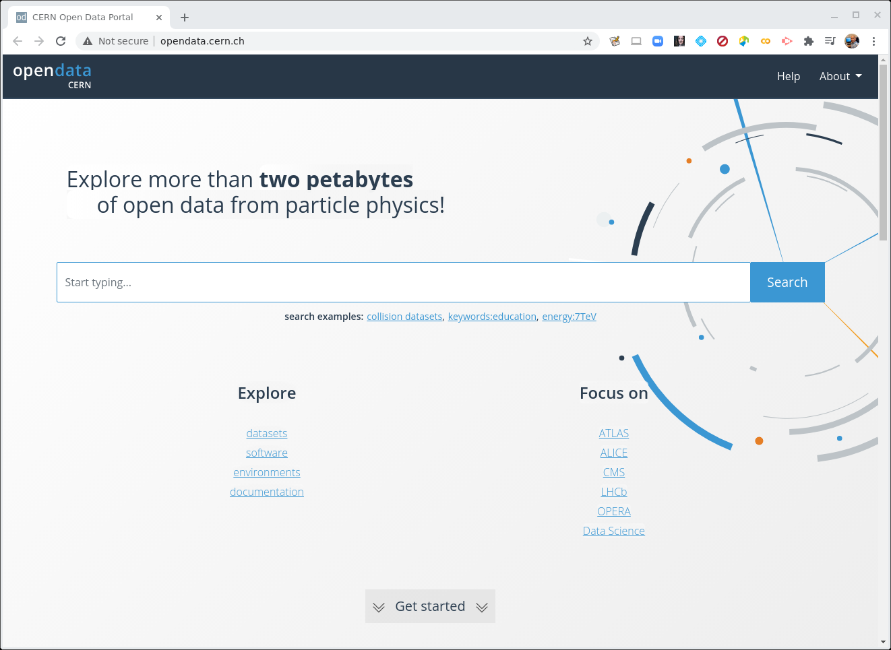
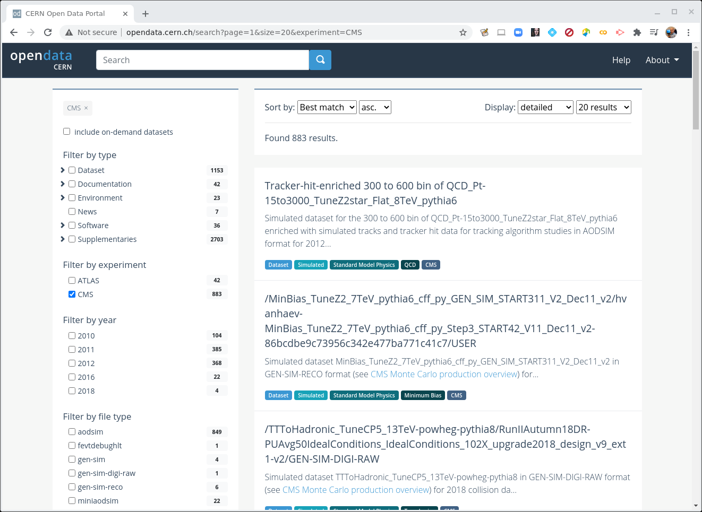

# CERN Open Data Portal

Our starting point is the landing page for [CERN Open Data Portal](http://opendata.cern.ch/).
You should definitely take some time to explore it but for now, since we are primarily working
with CMS data, you should find the CMS link under **Focus on** and click on it. 

> ## CERN Open Data Portal
> The landing page for the open data portal.
> 
{: .callout}

## CMS-specific datasets

The figure below shows the website after we have chosen the CMS data. Note the left-hand
sidebar that allows us to filter our selections. Let's see what's there. 
(*Note! I've collapsed some of the options so while the order is the same when you view it,
 your webpage may look a little different at first glance.*)

> ## CERN Open Data Portal - CMS data
> The first pass to filter on CMS data
> 
{: .callout}

At first glance we can see a few things. First, there is an option to select only **Dataset** rather 
than documentation or software or similar materials. Great! Going forward we'll select **Dataset**. 

Next we see that there are a lot of entries for data from **2010**, **2011**, and **2012**, the 7 TeV and 8 TeV running periods. 
That's what we'll be working with for these exercises. 

> ## Coming soon!
> For the keen of eye, you can see that there are some entries for 2016 and later data, the 13 TeV run periods! 
> But that will be for a future workshop. :)
{: .testimonial}

For the next module, let's select **Dataset** and **2012**. 



